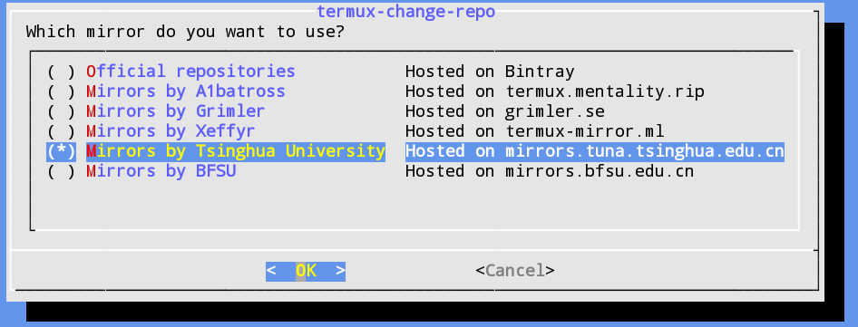
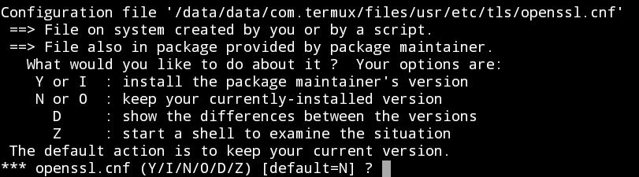

# Install Wifite2 via Andronix

- *Author:* Charl Cronje
- *Date:* 30 June 2022

_References_
- [https://github.com/chukfinley/termux](https://github.com/chukfinley/termux)
- [https://www.dipeshkarki1.com.np/2020/09/how-to-run-wifite-in-termux-on-android.html](https://www.dipeshkarki1.com.np/2020/09/how-to-run-wifite-in-termux-on-android.html)
- [https://www.codegrepper.com/code-examples/python/wifite+termux](https://www.codegrepper.com/code-examples/python/wifite+termux)
- [https://www.codegrepper.com/code-examples/shell/install+kali+in+termux+android](https://www.codegrepper.com/code-examples/shell/install+kali+in+termux+android)
- [https://m.apkpure.com/andronix-linux-on-android/studio.com.techriz.andronix](https://m.apkpure.com/andronix-linux-on-android/studio.com.techriz.andronix)

## Tested with [LDPlater](https://www.ldplayer.net/)

- [LDPlayer for PC](https://www.ldplayer.net/apps/gallery-on-pc.html)

## Install from Google Play Store

Usually I would have just installed Andronix from the Google Play Store, but for a few reasons it is no longer available. So the best alternative is to get it from [F-Droid](https://f-droid.org). F-Droid is an app store just like 

- You can also instal from APKPure: [https://m.apkpure.com/andronix-linux-on-android/studio.com.techriz.andronix](https://m.apkpure.com/andronix-linux-on-android/studio.com.techriz.andronix)
- On my Phone however I could install from the Google Play Store, so just open the Play Store and Search for Andronix
- Then it should look something like this


It might give you some errors and tell you to go to F-Droid, but just top on the button that looks like this:


- Tap on Proceed
- Tap on install
- Tap CLI Only
- Tap on Open Termux
- There will be something in the `Clipboard` you need to `paste`, so `paste` and hit enter
- That will install `Kali Linux Kernal`
- When that is done being installed then enter the following commands

```sh
apt-get update
```

Some updates will now installl, then enter the following commands

```sh
apt-get install git
```

That will install GIT, then enter the following commands

```sh
termux-change-repo
```

That will show you the following:


Select all Three Items so that it looks like this:


Then tap on okay, it should then look like this:



Select Mirrors by Tsinghue University like shown above and tap OK

Now enter the following command

```sh
apt-get update
apt-get upgrade
```

It might ask you the following question:



Type `y` to and hit `enter`

### Now lets install GIT, PHP, Python, Python2

### Now download Wifite2

Enter the followig command

```sh
git clone https://github.com/derv82/wifite2
cd wifite2
```

Then you can try running the follow command

```sh
sudo python Wifite
```

You might get the followign error:

```sh
No superuser binary detected
Are you rooted?
```

To get past this you need to install Turmux-Sudo, enter the follwing command

```sh
cd ..
git clone https://gitlab.com/st42/termux-sudo.git
pkg install ncurses-utils
cd termux-sudo
```

Execute the following commands to place sudo into the correct directory with the proper permissions and ownership

```sh
cat sudo > /data/data/com.termux/files/usr/bin/sudo
chmod 700 /data/data/com.termux/files/usr/bin/sudo
```

> That would have done the following

- Sets up its environment automatically on first run, no need to do anything but use it
- Creates a root folder `.suroot` in the `Termux` home folder with proper root permissions and ownership
- Creates `.bashrc` file in root folder with proper `PATH` and `LD_LIBRARY_PATH` variables set so all binaries function correctly
- Bash prompt `PS1` variable is also set so you don't have `bash-4.4#` as prompt just `#`

- Automatically creates `.bash_history` in root folder when you drop to a root shell so root shell history is preserved
- Can be used like ordinary `sudo` (but only as root, no other user)
- Can drop to root shell sudo `su` [-]
- Runs built in Termux binaries and exteral binaries with optional arguments as root in current directory
- Generates output in shell currently using
- Can be used in other bash scripts
- [option] Can turn off colored error messages be editing the variable colored at the beginning of sudo file


Now enter the follow command 

```sh
sudo su [-]
```

This might give you a new error:

```sh
su executable no found
```

In that case run the following command

```sh
pkg update
```

- It will again ask you to choose an option a few times, hit `y` and `enter` each time
- When that is done run the follwing

```sh
pkg upgrade
```

```sh
pkg install tsu
```

Now try and run the following:

```sh
cd ..
cd wifite2
python Wifite
```

> If it still gives errors then try the following

- Uninstall the Turmux app and ReInstall
- Then open Turmux without going via Andronix
- Then enter the following commands

```sh
apt-get update
```

Some updates will now installl, then enter the following commands

```sh
apt-get install git
```

That will install GIT, then enter the following commands

```sh
termux-change-repo
```

That will show you the following:


Select all Three Items so that it looks like this:


Then tap on okay, it should then look like this:


Select Mirrors by Tsinghue University like shown above and tap OK

Now enter the following command

```sh
apt-get update
apt-get upgrade
```

It might ask you the following question:


Type `y` to and hit `enter`


```sh
apt install git php python python2 -y
```

### Install Ubuntu in termux

```sh
git clone https://github.com/MFDGaming/ubuntu-in-termux
cd ubuntu-in-termux
chmod +x *
apt-get install proot
apt-get install wget
/ubuntu.sh -y
./startubuntu.sh
```

### Now download Wifite2

Enter the followig command

```sh
git clone https://github.com/derv82/wifite2
cd wifite2
```

Then you can try running the follow command

```sh
sudo python Wifite
```

If it still gives you errors about not having root access then you need to root your phone, you are wolcome to read about it and even attempt it, but it is not without rists:
<!-- @import "[TOC]" {cmd="toc" depthFrom=1 depthTo=6 orderedList=false} -->


## Now you need to install another app called SuperSU

- Install SuperSU, open your browser and go to the following URL: https://supersu.en.uptodown.com/android/download
- When it is done downloading, open the APK and if it asks you to accept installation just answer okay and let it install

- SuperSU should look something like this:


Tap on Start, for some devices that should be all that is nessesary

But for others you would also need to install [KingoRoot](https://root-apk.kingoapp.com/kingoroot-download.htm).

> To install KingoRoot open your browser and go to the following URL: [https://root-apk.kingoapp.com/kingoroot-download.htm](https://root-apk.kingoapp.com/kingoroot-download.htm)

- When the APK is done downloading, open it and let it install
- It will look like this:


- Tap on Root Device
- It will attempt to root device, or it will fail in which case you will see this screen:


> Here you can het Kingo to Root your device for you...

## Once device is rooted

- Open Andronix again
- Tap on this button again:


Now lets go try Wifite again, enter the folling commands:

```sh
cd ..
cd wifite2
python Wifite
```