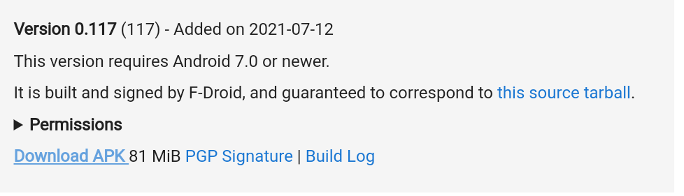

# Install Turmux

Termux can be installed from the Google Play Store, but it will be an out dated version.

- To get the new version that is not available on the Play Store, Open your browser and go to the following URL: https://f-droid.org/en/packages/com.termux/
- Scroll down until you see the following:

- Then tap on download APK
- When it is done downloading, open and install the APK file

It should only take a few seconds, [Go back](README.md)

